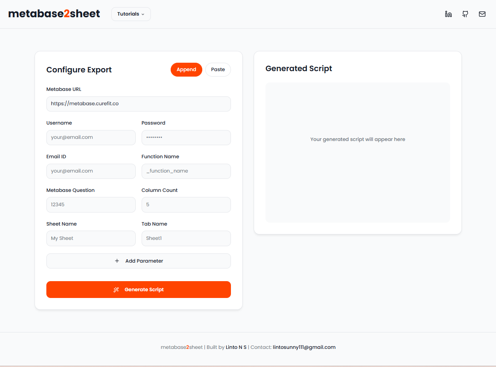

<p align="center">
  <a href="https://m2s-404linker.netlify.app/" target="_blank">
    
  </a>
</p>

# Metabase2Sheet

**Automate Metabase dashboards into Google Sheets — effortless, script-free, and real-time.**


Metabase2Sheet is a simple yet powerful open-source solution designed to automate the export of data from Metabase queries directly into Google Sheets.

This tool bridges the gap between your powerful Metabase analytics environment and the flexibility of Google Sheets for sharing, reporting, or further manual analysis. By automating this process, you can save countless hours of manual data export and copy-pasting.



## Features
* Effortless Automation: Schedule or manually run exports of your Metabase Question results.
* Simple Configuration: Use the frontend app to easily configure your export settings and generate the required automation script.
* Secure Connection: Uses Metabase API and Google Sheets API for secure, credential-based data transfer.
* Open Source: Built with Python, TypeScript, and JavaScript.

## Architecture
The repository is divided into two main components:

* ```frontend/```: A user-friendly web application (built primarily with TypeScript/JavaScript) used to configure the export parameters and generate the automation script.

* ```backend/```: The core logic (built with Python) that performs the connection to the Metabase API, fetches the data, and writes it to the specified Google Sheet via the Google Sheets API.

## Use the Web App
Access the hosted version of Metabase2Sheet here:  **[Metabase2Sheet](https://m2s-404linker.netlify.app/)** 

## Run Locally
### 0. Prerequisites

Before running the app, ensure you have the following installed:  
- **Python 3.11+**  
- **npm (Node Package Manager)**  
- **uv** (Python package and environment manager)  

### 1. Clone the Repository
```
git clone https://github.com/lintosunny/metabase2sheet.git
cd metabase2sheet
```

### 2. Setup Backend
```
cd backend
uv sync
uvicorn src.services.api:app --reload
```

### 3. Setup frontend
```
cd ../frontend
npm i
npm run dev
```

## Contact

For support, feedback, or contributions, reach out: 📧 lintosunny111@gmail.com
